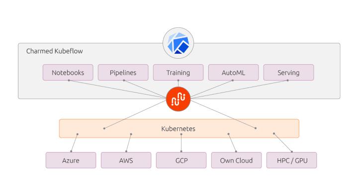
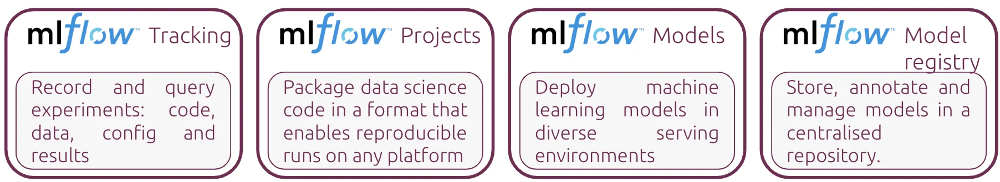
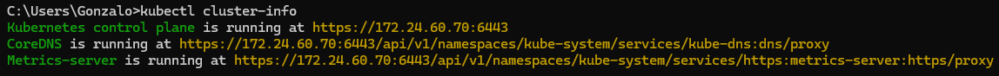

# MLab: Kubeflow + MLFlow !

This project aims to provide a comprehensive guide and practical implementation for setting up a robust MLOps environment. 

By leveraging the power of Kubeflow for Kubernetes resource orchestration and MLFlow for experiment tracking, you'll be able to streamline your machine learning workflow, from development to deployment.

The primary goals of this project are:

1. **Simplify MLOps Setup**: Provide step-by-step instructions for setting up a Kubernetes cluster with K3s, installing Kubeflow, and integrating MLFlow for end-to-end experiment tracking.

2. **Implement ML Algorithm**: Showcase the implementation of a machine learning algorithm from scratch, serving as a practical example for developing and tracking ML models.

3. **Promote Best Practices**: Demonstrate best practices for version control, reproducibility, and collaboration in machine learning projects, ensuring a smooth transition from research to production.

By following this project, you'll gain hands-on experience in building a production-ready MLOps environment, enabling you to efficiently manage and deploy machine learning models at scale.

## Introduction

### Kubeflow
Kubeflow is an open-source end-to-end MLOps platform started by Google a couple of years ago. It runs on any CNCF-compliant Kubernetes and enables professionals to develop and deploy machine learning models. Kubeflow is a suite of tools that automates machine learning workflows, in a portable, reproducible and scalable manner. 


Credits: Canonical


### MLFlow
MLFlow is an open-source platform, started by DataBricks a couple of years ago. It is used for managing machine learning workflows. It has various functions, such as experiment tracking. MLFlow can be integrated within any existing MLOps process, but it can also be used to build new ones. It provides standardised packaging, to be able to reuse the models in different environments. However, the most important part is the model registry component, which can be used with different ML tools. It provides guidance on how to use machine learning workloads, without being an opinionated tool that constrains users in any manner.


Credits: Canonical

# Environment Setup

## 1. Setting up Kubernetes
In this project, we will be using Kubernetes to orchestrate and manage our machine learning workflows. To get started, we'll need to set up a local Kubernetes cluster. We'll be using k3s, a lightweight Kubernetes distribution, provided by Rancher Desktop, which offers an easy-to-use solution for running Kubernetes on your local machine.

### 1.1 Steps to Set Up Kubernetes with Rancher Desktop:
1. **Install Rancher Desktop:**
   Follow the installation guide for Rancher Desktop based on your operating system:
   - Linux: [Installation Guide](https://docs.rancherdesktop.io/getting-started/installation#windows)
   - macOS: [Installation Guide](https://docs.rancherdesktop.io/getting-started/installation#macos)
   - Windows: [Installation Guide](https://docs.rancherdesktop.io/getting-started/installation#windows)

2. **Start Rancher Desktop:**
   Once installed, start Rancher Desktop from your system tray (macOS/Windows) or using the command line (Linux).

3. **Verify Cluster Setup:**
   - Once the cluster is set up, verify its status by running the following command in your terminal:
     ```
     kubectl cluster-info
     ```
    - Expected output:
    

### 1.2 Setting up Working Environment
Before diving into Kubeflow and MLFlow setup, let's ensure our Kubernetes environment is properly configured:

1. **Create Namespace:**
   - Open your terminal.
   - Run the following command to create a namespace for your project:
     ```
     kubectl create namespace ml-lab
     ```

2. **Set Namespace as Default (Optional):**
   - If you prefer working within a specific namespace by default, you can set it using the following command:
     ```
     kubectl config set-context --current --namespace=ml-lab
     ```

3. **Verify Namespace Creation:**
   - Confirm that the namespace is created successfully by running:
     ```
     kubectl get namespaces
     ```
   You should see `ml-lab` listed among the namespaces.

Now that our working environment is set up and configured, we're ready to proceed with setting up Kubeflow and MLFlow for our machine learning workflows.

## 2. Setting up Kubeflow

## 3. Setting up MLFlow

## Additional Resources:
- [Rancher Desktop Documentation](https://docs.rancherdesktop.io/)
- [k3s Documentation](https://docs.k3s.io/)